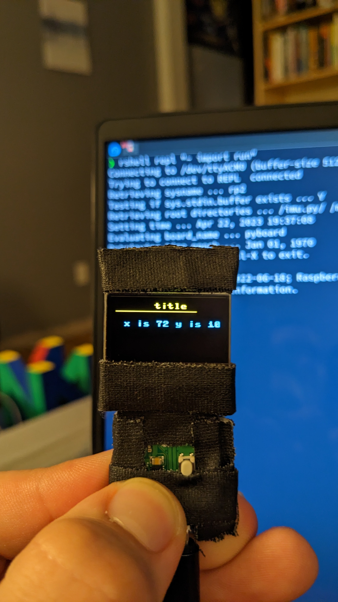

# pico-oled-demo
Practicing with the rp2040 pi pico, and a SSD1306 for general micropython and PIO stuff.

  

---

# Pico OLED Demo(s)

This project is a simple demo of using the RP2040 Pi Pico and a SSD1306 OLED display with Micropython. The demo code provides an example of how to initialize the I2C interface, connect to the OLED display, and render some interesting framebuff demos.

## Getting Started

To use this demo code, you will need a RP2040 Pi Pico board and a SSD1306 OLED display. You will also need to have Micropython installed on your board.

### Wiring

Connect the SSD1306 OLED display to the RP2040 Pi Pico board as follows:

- OLED VCC to Pico 3V3 pin
- OLED GND to Pico GND pin
- OLED SCL to Pico GP1 pin
- OLED SDA to Pico GP0 pin

### Installing Micropython

If you haven't already, you will need to install Micropython on your RP2040 Pi Pico board. Instructions for doing so can be found in the [official Micropython documentation](https://micropython.org/download/rp2-pico/).

### Running the Demo

1. Copy the demo code to a file named `main.py` on your RP2040 Pi Pico board.
2. Connect your RP2040 Pi Pico board to your computer via USB.
3. Use a terminal program to connect to the board's serial console at a baud rate of 115200. [I'm a big fan of rshell](https://github.com/dhylands/rshell)
4. Reset the board by pressing the RESET button.

## TODO
5. The OLED should now be doing its thing, with the RESET button having been hijacked to cycle through demos!

## Acknowledgments

This project is inspired by the excellent [Adafruit_SSD1306 library](https://github.com/adafruit/Adafruit_SSD1306) and the [official Micropython documentation](https://docs.micropython.org/en/latest/). Special thanks to the Micropython and Pi Pico communities for their support and contributions.
